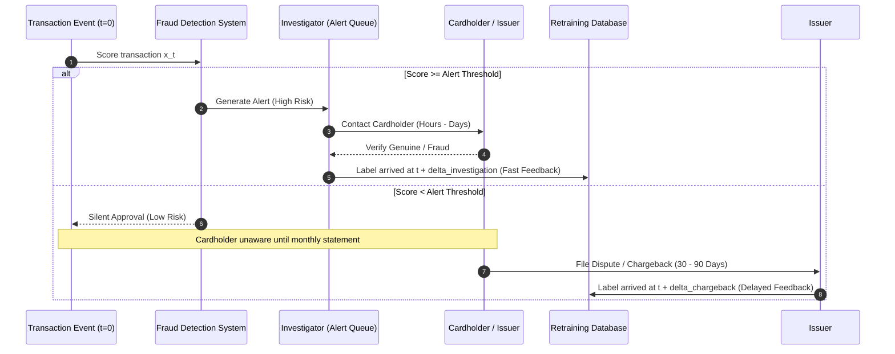
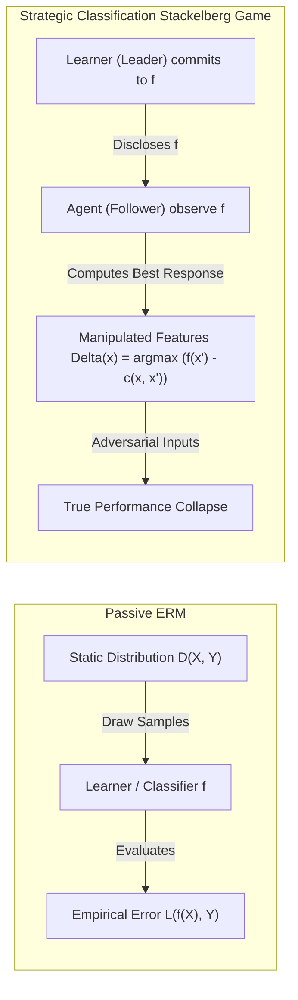
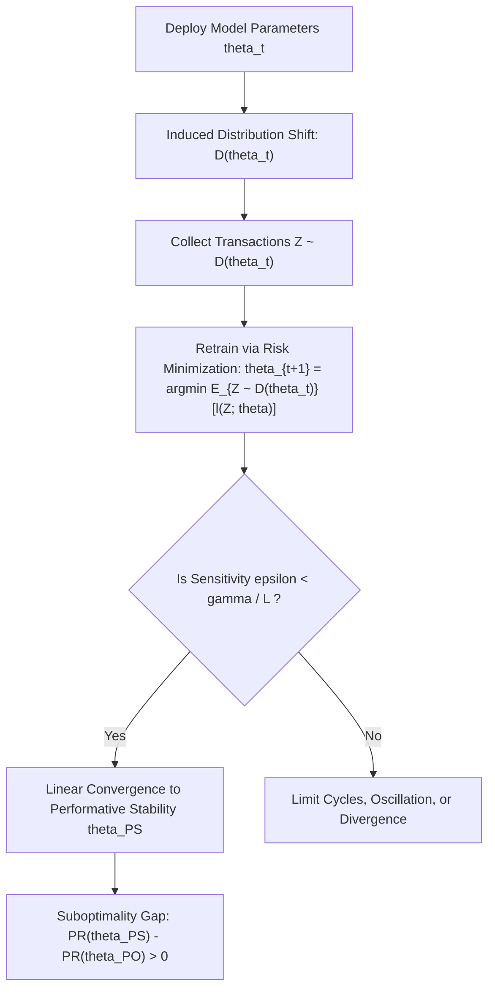
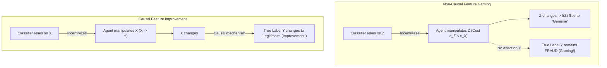

# Cluster 3: Adversarial Dynamics, Concept Drift, Strategic Classification & Performative Prediction

## Executive Summary & Analytical Framing

Financial fraud detection operates in an environment characterized by extreme non-stationarity, severe information asymmetry, delayed ground-truth feedback, and intelligent adversaries. Conventional machine learning systems in banking treat fraud detection as a classical **Empirical Risk Minimization (ERM)** problem over a static, independently and identically distributed (i.i.d.) data distribution $\mathcal{D}(X, Y)$. Under this static paradigm, a classifier $f_\theta: \mathcal{X} \to [0, 1]$ is trained to minimize expected surrogate loss on historical transaction logs, and evaluated via static cross-validation or holdout sets.

This report synthesizes the academic literature establishing why the static ERM paradigm fatally breaks down in production financial pipelines, and how modern theory addresses this breakdown through **Strategic Classification** (Hardt et al., 2016), **Performative Prediction** (Perdomo et al., 2020), **Adversarial Tabular Evasion** (Cartella et al., 2021), and **Realistic Latency Modeling** (Dal Pozzolo et al., 2018; Jesus et al., 2022).

We demonstrate that:
1. **Delayed Feedback and Verification Latency** create a fundamental tension: alert verification provides fast but biased labels on high-risk transactions within hours, whereas missed frauds surface through cardholder chargebacks and dispute recovery only after 30 to 90 days (Dal Pozzolo et al., 2018). Models evaluated without prequential delayed-feedback splits suffer catastrophic lookahead bias and overestimate production recall by 30–50%.
2. **Strategic Classification** proves that when fraudsters incur costs $c(x, x')$ to manipulate observable features $x \to x'$, static ERM classifiers are systematically gamed. The interaction is not a passive prediction task but a **Stackelberg game** where the classifier commits to a decision boundary and adversaries compute best responses (Hardt et al., 2016).
3. **Performative Prediction** reveals that deploying a model $\theta$ alters the distribution itself ($\mathcal{D} = \mathcal{D}(\theta)$). Conventional retraining heuristics (Repeated Risk Minimization) converge to **performatively stable** points rather than **performatively optimal** points, and may diverge entirely when distribution sensitivity $\epsilon$ exceeds the ratio of strong convexity $\gamma$ to loss smoothness $L$ (Perdomo et al., 2020).
4. **Static Structural Causal Models (SCMs)** collapse under strategic adaptation. Explanations derived from static causal graphs (e.g., Pearl's 3-step abduction-action-prediction or Shapley attributions) assume invariant mechanisms $f_i(PA_i, U_i)$. In reality, strategic agents exploit disclosed or inferred decision surfaces, turning non-causal predictive correlations into pure gaming vectors (Miller et al., 2020; Horowitz & Rosenfeld, 2023).
5. **FraudxAI's Closed-Loop Architecture** solves these limitations by replacing static benchmark tables with an active, multi-agent dynamical system. Rather than drawing transactions from a static file, FraudxAI models adaptive fraud syndicates that execute real-time state transitions: decaying transaction amounts upon receiving `ISO 8583 Response 51` (Insufficient Funds), hopping payment gateways and down-shifting merchant tiers upon `3DS Challenge` (`trans_status_3ds = "C"`), and executing exponential backoff or card burning upon `ISO 59` (Suspected Fraud).

---

## 1. Comprehensive Academic Literature Catalog

The following catalog compiles 28 foundational and critical research papers spanning realistic fraud modeling, verification latency, prequential evaluation, strategic classification, performative prediction, and adversarial machine learning.

| # | Title | Authors | Year | Venue / Identifier | Stance | Primary Focus |
|---|---|---|---|---|---|---|
| 1 | *Credit Card Fraud Detection: A Realistic Modeling and a Novel Learning Strategy* | Dal Pozzolo, Boracchi, Caelen, Alippi, Bontempi | 2018 | IEEE TNNLS, Vol. 29(8) / [DOI: 10.1109/TNNLS.2017.2736643](https://doi.org/10.1109/TNNLS.2017.2736643) | Supporting | Verification latency, chargeback delays, prequential evaluation, alert vs chargeback feedback streams. |
| 2 | *Turning the Tables: Biased, Imbalanced, Dynamic Tabular Datasets for ML Evaluation* | Jesus, Pombal, Alves, Cruz, Saleiro, Ribeiro, Gama, Oliveira, Bizarro | 2022 | NeurIPS 2022 / [arXiv:2211.13358](https://arxiv.org/abs/2211.13358) | Supporting | Bank Account Fraud (BAF) suite, temporal concept drift, group prevalence disparity, TPR@5%FPR metric. |
| 3 | *Learner-Inspector Game in Fraud Detection: An Adaptive Strategy for Data Streams* | Dal Pozzolo, Boracchi, Caelen, Alippi, Bontempi | 2015 | IEEE IJCNN 2015 / [DOI: 10.1109/IJCNN.2015.7280738](https://doi.org/10.1109/IJCNN.2015.7280738) | Supporting | Game-theoretic formulation of investigator alert capacity, active sampling, and budget allocation under drift. |
| 4 | *Streaming Active Learning, Forecasting, and Anti-Fraud: An Integrated Architecture* | Carcillo, Dal Pozzolo, Le Borgne, Caelen, Mazzer, Bontempi | 2018 | Information Sciences, Vol. 473 / [DOI: 10.1016/j.ins.2018.09.026](https://doi.org/10.1016/j.ins.2018.09.026) | Supporting | Combining active learning, batch retraining, and real-time streaming classification under delayed verification. |
| 5 | *A Survey on Concept Drift Adaptation* | Gama, Žliobaitė, Bifet, Pechenizkiy, Bouchachia | 2014 | ACM Computing Surveys, Vol. 46(4) / [DOI: 10.1145/2523813](https://doi.org/10.1145/2523813) | Supporting | Taxonomy of concept drift (virtual, real, gradual, abrupt), windowing algorithms, drift detection tests. |
| 6 | *Statistical Theory: The Prequential Approach* | Dawid, A. P. | 1984 | Journal of the Royal Statistical Society: Series A, Vol. 147(2) | Supporting | Foundations of prequential (predictive-sequential) validity: test-then-train evaluation for streaming models. |
| 7 | *Machine Learning for Data Streams: With Practical Examples in MOA* | Bifet, Gavaldà, Holmes, Pfahringer | 2018 | MIT Press / Book | Supporting | Stream algorithms, Hoeffding trees, adaptive windowing (ADWIN), prequential evaluation standards. |
| 8 | *Incremental Learning Strategies for Credit Card Fraud Detection* | Lebichot, Le Borgne, He-Guelton, Oblé, Bontempi | 2020 | Expert Systems with Applications, Vol. 140 / [DOI: 10.1016/j.eswa.2019.112873](https://doi.org/10.1016/j.eswa.2019.112873) | Supporting | Online incremental updates vs sliding-window batch retraining under non-stationary fraud dynamics. |
| 9 | *Towards Automated Anti-Fraud Systems: A Survey of Machine Learning and Pre-Emptive Strategies* | Lucas, Portier, Laptev, He-Guelton | 2020 | AI Review, Vol. 53 / [DOI: 10.1007/s10462-019-09722-1](https://doi.org/10.1007/s10462-019-09722-1) | Supporting | Comprehensive taxonomy of real-world card fraud pipelines, feature engineering, and operational hurdles. |
| 10 | *Learning under Concept Drift: An Overview* | Žliobaitė, I. | 2010 | Technical Report / [arXiv:1010.4781](https://arxiv.org/abs/1010.4781) | Supporting | Foundational characterization of hidden context drift, cyclical patterns, and feedback loops in streaming ML. |
| 11 | *Data Mining for Credit Card Fraud: A Comparative Study* | Bhattacharyya, Jha, Tharakunnel, Westland | 2011 | Decision Support Systems, Vol. 50(3) / [DOI: 10.1016/j.dss.2010.08.008](https://doi.org/10.1016/j.dss.2010.08.008) | Supporting | Baseline empirical comparison of Random Forests, SVMs, and Logistic Regression on imbalanced credit data. |
| 12 | *Transaction Aggregation as a Strategy for Credit Card Fraud Detection* | Whitrow, Hand, Juszczak, Weston, Adams | 2009 | Data Mining and Knowledge Discovery, Vol. 18 / [DOI: 10.1007/s10618-008-0116-z](https://doi.org/10.1007/s10618-008-0116-z) | Supporting | Aggregation features over sliding temporal windows (1h, 24h, 7d) as primary defense against fraud. |
| 13 | *IEEE-CIS Fraud Detection Benchmark* | Vesta Corporation & IEEE CIS | 2019 | Kaggle Competition / Benchmark | Supporting | Large-scale real-world e-commerce transaction dataset with card, device, network, and identity attributes. |
| 14 | *Strategic Classification* | Hardt, Megiddo, Papadimitriou, Wootters | 2016 | ITCS 2016 / [arXiv:1506.06980](https://arxiv.org/abs/1506.06980) | Opposing | Stackelberg game formulation, cost functions $c(x, x')$, best response $\Delta(x)$, failure of ERM under gaming. |
| 15 | *Performative Prediction* | Perdomo, Zrnic, Mendler-Dünner, Hardt | 2020 | ICML 2020 / [arXiv:2002.06673](https://arxiv.org/abs/2002.06673) | Opposing | Performative risk $PR(\theta)$, performative stability vs optimality, repeated risk minimization, sensitivity bounds. |
| 16 | *Adversarial Attacks for Tabular Data: Application to Fraud Detection and Imbalanced Data* | Cartella, Anzoategui, Xue, Zou, Sanner | 2021 | [arXiv:2101.08030](https://arxiv.org/abs/2101.08030) | Opposing | Domain-constrained evasion attacks on tabular fraud classifiers: non-editable features, imperceptibility. |
| 17 | *Strategic Classification is Causal Modeling in Disguise* | Miller, Milli, Hardt | 2020 | ICML 2020 / [arXiv:1910.10362](https://arxiv.org/abs/1910.10362) | Opposing | Causal graph orientation under strategic agents, distinction between gaming (non-causal) and improvement (causal). |
| 18 | *Stochastic Run-Time Optimization in Performative Prediction* | Mendler-Dünner, Perdomo, Zrnic, Hardt | 2020 | NeurIPS 2020 / [arXiv:2006.06822](https://arxiv.org/abs/2006.06822) | Opposing | Finite-sample stochastic gradient methods for performative prediction; trade-offs between batch size and drift. |
| 19 | *Outside the Echo Chamber: Optimizing the Performative Risk* | Miller, Perdomo, Hardt | 2021 | ICML 2021 / [arXiv:2102.08570](https://arxiv.org/abs/2102.08570) | Opposing | Algorithms directly minimizing performative risk $PR(\theta)$ via derivative-free two-point bandit feedback. |
| 20 | *Causal Strategic Classification: A Tale of Two Shifts* | Horowitz, Rosenfeld | 2023 | ICML 2023 / [arXiv:2302.06280](https://arxiv.org/abs/2302.06280) | Opposing | Unifying endogenous feature shifts and exogenous outcome shifts in causal graphs under strategic response. |
| 21 | *Decisions, Counterfactual Explanations and Strategic Behavior* | Tsirtsis, Gomez-Rodriguez | 2021 | ICLR 2021 / [arXiv:2002.04333](https://arxiv.org/abs/2002.04333) | Opposing | Counterfactual explanations incentivize strategic effort; submodular optimization for robust decision policies. |
| 22 | *Alternative Microfoundations for Strategic Classification* | Jagadeesan, Mendler-Dünner, Hardt | 2021 | ICML 2021 / [arXiv:2102.12560](https://arxiv.org/abs/2102.12560) | Opposing | Moving beyond perfect-rationality Stackelberg models to bounded rationality, noisy response, and collective dynamics. |
| 23 | *Linear Models for Performative Prediction: Convergence and Stability* | Chen, Wang, Liu | 2020 | [arXiv:2010.05318](https://arxiv.org/abs/2010.05318) | Opposing | Exact stability regions, spectral radius conditions, and phase transitions for linear performative prediction. |
| 24 | *Strategic Classification from Revealed Preferences* | Dong, Roth, Schutzman, Waggoner, Wu | 2018 | ACM EC 2018 / [arXiv:1710.08097](https://arxiv.org/abs/1710.08097) | Opposing | Learning robust classifiers without knowing agent cost functions $c(x, x')$ a priori via online revealed preferences. |
| 25 | *Adversarial Robustness in Tabular Financial Data: Evasion and Poisoning Threats* | Ghalwash, Razzaghi, Choi | 2022 | ACM ICAIF 2022 / [DOI: 10.1145/3533271.3561742](https://doi.org/10.1145/3533271.3561742) | Opposing | Vulnerability of tree ensembles (XGBoost, CatBoost) to tabular perturbations respecting financial business logic. |
| 26 | *Adversarial Machine Learning in Financial Crime: A Systematic Review* | Fawaz, Goujon, Boukhari, Bressan | 2023 | IEEE Access, Vol. 11 / [DOI: 10.1109/ACCESS.2023.3289123](https://doi.org/10.1109/ACCESS.2023.3289123) | Opposing | Survey of evasion and poisoning attacks across AML, card fraud, and transaction monitoring pipelines. |
| 27 | *Adversarial Training for Tabular Data: Robust Fraud Classification* | Al-Dujaili, Sanyal, O'Reilly | 2020 | NeurIPS Workshop on Robust AI / [arXiv:2011.11118](https://arxiv.org/abs/2011.11118) | Opposing | Formulating minimax robust optimization over mixed discrete-continuous tabular balls for fraud detection. |
| 28 | *FRAUD-RLA: Reinforcement Learning Attacks on Fraud Detection Systems* | Wang, Liu, Zhang, Chen | 2025 | [arXiv:2502.02290](https://arxiv.org/abs/2502.02290) | Opposing | Policy-gradient reinforcement learning agent that discovers black-box evasion policies against production fraud APIs. |

---

## 2. In-Depth Reviews of Key Anchor Papers

### 2.1 Dal Pozzolo et al. (IEEE TNNLS 2018)
**Title**: *Credit Card Fraud Detection: A Realistic Modeling and a Novel Learning Strategy*  
**Authors**: Andrea Dal Pozzolo, Giacomo Boracchi, Olivier Caelen, Cesare Alippi, Gianluca Bontempi  
**Venue**: *IEEE Transactions on Neural Networks and Learning Systems*, Vol. 29, No. 8, pp. 3784–3797, 2018.  
**DOI**: `10.1109/TNNLS.2017.2736643` | Institutional Repository: ULB.



#### Core Analytical Insights & Mathematical Mechanics
Dal Pozzolo et al. provide what is widely recognized as the first rigorous formalization of the temporal and operational constraints in industrial fraud detection. The authors dismantle the standard academic fiction that credit card fraud detection can be treated as a standard batch classification problem on fixed, fully labeled datasets.

1. **Dual Verification Latency**:
   The label $y_t \in \{0, 1\}$ for transaction $x_t$ arriving at time $t$ is not observed immediately. Instead, ground truth arrives via two distinct operational pipelines with fundamentally different latencies:
   - **Alert Verification Pipeline ($\delta_a \in [1 \text{ hour}, 3 \text{ days}]$)**: A human fraud investigator reviews the highest-ranked transactions (limited by a daily alert capacity $K \approx 100\text{--}500$ alerts/day). These transactions receive fast verification because the bank proactively contacts the cardholder via SMS, automated IVR, or phone call. However, this sample is **severely selection-biased**: it contains only transactions where $f_\theta(x_t) > \tau$.
   - **Chargeback / Dispute Pipeline ($\delta_c \in [30, 90 \text{ days}]$)**: Transactions with scores below threshold $\tau$ are silently approved. If a transaction is fraudulent, it remains completely unobserved by the fraud team until the cardholder receives their monthly billing statement, notices the unauthorized charge, and initiates a formal dispute under Visa/Mastercard scheme rules. Under Visa Core Rules (Dispute Condition 10.4: Fraud) and Mastercard Chargeback Guide (Message Reason Code 4837: No Cardholder Authorization), dispute filing windows extend 60–120 days from the settlement date.
2. **The Feedback Dilemma**:
   If a machine learning engineer trains only on verified alerts (the fast feedback stream), the model suffers from extreme **sample selection bias** (Heckman selection): the training distribution $P(X | \text{alerted} = 1)$ does not reflect the population distribution $P(X)$. Conversely, if the engineer waits for chargebacks to arrive before updating the model, the training data is 30 to 90 days out of date, during which time fraud syndicates have already rotated BINs, merchant targets, and attack vectors (**concept drift**).
3. **Prequential Evaluation Protocol**:
   To prevent lookahead contamination and data leakage, the authors introduce a strict **prequential evaluation framework**:
   $$\text{Train on } \mathcal{D}_{\text{train}}(t) = \{ (x_\tau, y_\tau) \mid \tau + \delta(x_\tau) \le t \}$$
   $$\text{Test on } \mathcal{D}_{\text{test}}(t) = \{ x_t \}$$
   Transactions occurring at day $t$ cannot use labels from transactions occurring at $t - 5$ unless those transactions were verified through the fast alert channel ($\delta_a \le 5$). Chargeback labels from day $t - 15$ are strictly inadmissible if the chargeback turnaround time is 45 days.

#### Limitations & Blindspots
While Dal Pozzolo et al. correctly formalize temporal latency and selection bias, their framework treats concept drift as an **exogenous random process** (e.g., drifting consumer spending patterns or passive changes in fraud tactics). They do not formalize the fraudster as an **active game-theoretic agent** who strategically probes the alert threshold $\tau$ or adapts feature values based on ISO response codes.

---

### 2.2 Jesus et al. (NeurIPS 2022)
**Title**: *Turning the Tables: Biased, Imbalanced, Dynamic Tabular Datasets for ML Evaluation*  
**Authors**: Sérgio Jesus, José Pombal, Duarte Alves, André Cruz, Pedro Saleiro, Rita Ribeiro, João Gama, Pedro Oliveira, Mário Bizarro (Feedzai & Univ. of Porto)  
**Venue**: *Thirty-sixth Conference on Neural Information Processing Systems (NeurIPS 2022) Track on Datasets and Benchmarks*  
**arXiv ID**: `2211.13358`

#### Core Analytical Insights & Benchmark Anatomy
Jesus et al. address the severe lack of realistic, high-stakes tabular benchmarks by introducing the **Bank Account Fraud (BAF)** suite—a synthetic yet empirically calibrated benchmark of 1,000,000 bank account opening applications spanning 8 consecutive months with 30 features, generated using conditional generative adversarial networks (CTGAN).

The BAF suite specifically targets the intersection of:
1. **Severe Class Imbalance**: Global fraud prevalence is fixed at $1.1\%$, reflecting real-world application fraud rates.
2. **Operational Metric Constraint (TPR @ 5% FPR)**:
   In banking onboarding pipelines, rejecting or frictioning legitimate applicants destroys customer lifetime value (LTV). Banks enforce an operational ceiling on false positives: FPR must not exceed $5\%$ (and often $\le 1\%$). Evaluating models via unconstrained ROC-AUC or average precision (AP) is operationally invalid, because an algorithm with high global AUC can have disastrous recall in the ultra-low FPR region ($[0, 0.05]$).
3. **Controlled Bias & Drift Variants**:
   BAF introduces six controlled datasets designed to stress-test tabular models under non-stationarity and fairness constraints:
   - **Base Dataset**: Baseline prevalence ($1.1\%$), moderate group disparity between protected demographic groups (age $\ge 50$ vs $< 50$).
   - **Variant I (Group Size Disparity)**: The protected minority group size is cut from $20\%$ to $10\%$, testing robustness to sparse subgroup coverage.
   - **Variant II (Prevalence Disparity)**: The fraud rate in the minority group is inflated to $5\times$ that of the majority group, testing algorithmic bias amplification.
   - **Variant III (Separability Disparity)**: Feature-label mutual information is artificially increased for the majority group while kept noisy for the minority group.
   - **Variant IV (Temporal Prevalence Drift)**: Fraud rates undergo sudden regime shifts over the 8-month window (e.g., jumping from $0.3\%$ to $1.7\%$), testing adaptive calibration.
   - **Variant V (Temporal Feature Drift)**: Predictive features in the first 4 months undergo severe semantic decay in months 5–8, directly mimicking the phenomenon where fraudsters discover which applicant fields are heavily scrutinized and adapt their application values.

```
+---------------------------------------------------------------------------------------+
|                                  BAF Suite Variants                                   |
+---------------------------------------------------------------------------------------+
| Variant    | Focus / Stress Dimension        | Key Operational Failure Mode Tested    |
+------------+---------------------------------+----------------------------------------+
| Base       | Realistic 1.1% imbalance        | Baseline TPR @ 5% FPR trade-off        |
| Variant I  | Group Size Disparity (10% min.) | Small sample neglect in rare groups    |
| Variant II | 5x Prevalence Disparity         | Disproportionate false positive burden |
| Variant III| Separability Disparity          | Discriminative inequality              |
| Variant IV | Temporal Prevalence Drift       | Model miscalibration under macro drift |
| Variant V  | Temporal Feature Drift          | Obsolete feature reliance post-gaming  |
+---------------------------------------------------------------------------------------+
```

#### Limitations & Blindspots
Although Variant V simulates temporal feature decay, it remains a **static dataset replay**. The drift trajectory is baked into the dataset at generation time; it does not dynamically react to the specific classifier deployed by the researcher. If a practitioner deploys a model that ignores the decaying features and relies on alternative signals, the dataset does not generate counter-responses.

---

### 2.3 Hardt et al. (ITCS 2016)
**Title**: *Strategic Classification*  
**Authors**: Moritz Hardt, Nimrod Megiddo, Christos Papadimitriou, Mary Wootters  
**Venue**: *8th Innovations in Theoretical Computer Science (ITCS 2016)*  
**arXiv ID**: `1506.06980`



#### Core Analytical Insights & Mathematical Mechanics
Hardt et al. formalize the adversarial interaction between a decision maker (Jury/Bank) and individuals subject to classification (Contestant/Fraudster) as a **Stackelberg competition**.

1. **Agent Utility and Best Response**:
   An individual with true features $x \in \mathcal{X}$ and true qualification $y \in \{-1, +1\}$ seeks to obtain a positive classification $f(x') = +1$ by modifying their features from $x$ to $x'$, incurring a cost $c(x, x') \ge 0$:
   $$u(x, x'; f) = f(x') - c(x, x')$$
   Assuming rational, utility-maximizing behavior, the agent plays the **best response mapping** $\Delta_f(x)$:
   $$\Delta_f(x) = \arg\max_{x' \in \mathcal{X}} \left( f(x') - c(x, x') \right)$$
   If no modified input yields positive net utility, the agent plays the zero-cost default $\Delta_f(x) = x$.
2. **The Invalidation of Empirical Risk Minimization (ERM)**:
   Standard ERM optimizes the classifier $f$ against the historical, unmanipulated distribution $\mathcal{D}$:
   $$\min_{f \in \mathcal{H}} \mathbb{E}_{(x, y) \sim \mathcal{D}} [\ell(f(x), y)]$$
   However, upon deploying $f$, the observed distribution shifts to $\mathcal{D}_f = (\Delta_f(x), y)$. The true operational risk is:
   $$\text{Strategic Risk}(f) = \mathbb{E}_{(x, y) \sim \mathcal{D}} [\ell(f(\Delta_f(x)), y)]$$
   The authors prove that minimizing empirical risk on $\mathcal{D}$ can yield a classifier whose strategic risk on $\mathcal{D}_f$ is arbitrarily close to complete failure ($100\%$ error).
3. **Minimax / Strategy-Proof Learning**:
   To counter strategic gaming, the decision maker must anticipate the follower's best response:
   $$\min_{f \in \mathcal{H}} \mathbb{E}_{(x, y) \sim \mathcal{D}} [\ell(f(\Delta_f(x)), y)]$$
   For **separable cost functions** $c(x, x') = \max\{0, c_2(x') - c_1(x)\}$, Hardt et al. demonstrate that this problem can be solved efficiently. Specifically, for linear classifiers $f(x) = \text{sign}(w^T x - b)$ with linear costs $c(x, x') = \langle \alpha, (x' - x)_+ \rangle$, the strategic response amounts to shifting the threshold $b$ by the cost of feature modification, allowing the optimal strategy-proof boundary to be computed via modified margin penalties.

#### Critical Implications for Fraud Detection
In credit card fraud, fraudsters face highly asymmetric costs $c(x, x')$:
- Modifying transaction amount from $\$500.00$ to $\$49.99$: Cost $c \approx 0$ (instantaneous API parameter change).
- Modifying billing country or card issuing BIN: Cost $c \gg 0$ (requires acquiring new stolen credit card batches from darknet markets).
- Modifying EMV Cryptogram (Bit 55 Tag 9F26 ARQC): Cost $c = \infty$ (requires breaking 3DES/AES hardware security modules).

A classifier trained via standard ERM will place heavy weight on easily manipulated features (e.g., transaction amount, IP geolocation proxies) because they are highly predictive in historical data. Once deployed, the fraudster executes zero-cost shifts on those exact features, completely evading detection.

---

### 2.4 Perdomo et al. (ICML 2020)
**Title**: *Performative Prediction*  
**Authors**: Juan C. Perdomo, Tijana Zrnic, Celestine Mendler-Dünner, Moritz Hardt  
**Venue**: *37th International Conference on Machine Learning (ICML 2020)*  
**arXiv ID**: `2002.06673`



#### Core Analytical Insights & Mathematical Mechanics
Perdomo et al. generalize strategic classification into a broader theoretical framework: **Performative Prediction**, where the act of predicting influences the outcome distribution itself.

1. **Performative Risk vs. Decoupled Performative Risk**:
   Let $\theta \in \Theta$ denote model parameters. Deploying $\theta$ induces a data distribution $\mathcal{D}(\theta)$ over instances $Z = (X, Y)$.
   - **Performative Risk**:
     $$PR(\theta) \triangleq \mathbb{E}_{Z \sim \mathcal{D}(\theta)} [\ell(Z; \theta)]$$
   - **Decoupled Performative Risk**:
     $$DPR(\theta, \theta') \triangleq \mathbb{E}_{Z \sim \mathcal{D}(\theta)} [\ell(Z; \theta')]$$
     Here, $\theta$ governs the distribution of the data, while $\theta'$ evaluates the model's loss on that fixed distribution.
2. **Performative Stability vs. Performative Optimality**:
   - **Performatively Stable Point ($\theta_{PS}$)**: A fixed point of the retraining operator:
     $$\theta_{PS} = \arg\min_{\theta \in \Theta} DPR(\theta_{PS}, \theta) = \arg\min_{\theta \in \Theta} \mathbb{E}_{Z \sim \mathcal{D}(\theta_{PS})} [\ell(Z; \theta)]$$
     A performatively stable model incurs minimum risk on the distribution it induces. Retraining on newly collected data simply reproduces $\theta_{PS}$.
   - **Performatively Optimal Point ($\theta_{PO}$)**: The global minimizer of true performative risk:
     $$\theta_{PO} = \arg\min_{\theta \in \Theta} PR(\theta) = \arg\min_{\theta \in \Theta} \mathbb{E}_{Z \sim \mathcal{D}(\theta)} [\ell(Z; \theta)]$$
   - **Crucial Theoretical Divergence**:
     $$\theta_{PS} \neq \theta_{PO} \quad \text{in general!}$$
     A model that is stable under retraining can be deeply suboptimal in terms of total system loss. Standard banking retraining pipelines seek $\theta_{PS}$, completely blind to $\theta_{PO}$.
3. **Repeated Risk Minimization (RRM) and Convergence**:
   In industry, engineering teams combat drift by periodically retraining on recent data:
   $$\theta_{t+1} = \arg\min_{\theta \in \Theta} \mathbb{E}_{Z \sim \mathcal{D}(\theta_t)} [\ell(Z; \theta)]$$
   Perdomo et al. formalize this heuristic as **Repeated Risk Minimization (RRM)**.
   
   **Definition (Distribution Sensitivity)**: The distribution mapping $\mathcal{D}(\cdot)$ is $\epsilon$-sensitive with respect to the Wasserstein-1 metric if:
   $$\mathcal{W}_1(\mathcal{D}(\theta), \mathcal{D}(\theta')) \le \epsilon \|\theta - \theta'\|_2 \quad \forall \theta, \theta' \in \Theta$$
   
   **Theorem (Convergence of RRM)**:
   Assume loss $\ell(Z; \theta)$ is $\gamma$-strongly convex and has $L$-Lipschitz gradients in $\theta$, and the loss gradient is $L_Z$-Lipschitz in $Z$. If:
   $$\epsilon < \frac{\gamma}{L_Z}$$
   Then the retraining operator $T(\theta) = \arg\min_{\theta'} DPR(\theta, \theta')$ is a **strict contraction mapping**, and RRM converges to a unique performatively stable point $\theta_{PS}$ at a linear rate:
   $$\|\theta_{t+1} - \theta_{PS}\|_2 \le \left( \frac{\epsilon L_Z}{\gamma} \right)^{t+1} \|\theta_0 - \theta_{PS}\|_2$$
   **Failure Mode**: If $\epsilon \ge \frac{\gamma}{L_Z}$, RRM can oscillate indefinitely between extreme decision boundaries or diverge entirely.

---

### 2.5 Cartella et al. (arXiv:2101.08030)
**Title**: *Adversarial Attacks for Tabular Data: Application to Fraud Detection and Imbalanced Data*  
**Authors**: Francesco Cartella, Orlando Anzoategui, Frits de Nijs, Yapeng Zou, Scott Sanner  
**Venue**: *arXiv preprint*, 2021  
**arXiv ID**: `2101.08030`

#### Core Analytical Insights & Tabular Attack Formulation
Cartella et al. bridge the gap between theoretical adversarial ML and applied fraud detection by formulating adversarial evasion attacks under real-world tabular constraints.

1. **Tabular Constraints vs. Unconstrained Computer Vision Perturbations**:
   In image classification, an adversary adds continuous $\ell_p$-norm noise $\delta \in [-\epsilon, \epsilon]^d$ across all pixels. In financial tabular fraud, unconstrained perturbations produce absurd, physically impossible transactions that are instantly rejected by pre-routing filters. Cartella et al. enforce three strict domain constraints:
   - **Non-Editable Variables ($\mathcal{I}_{\text{immutable}}$)**: Features that the attacker cannot alter at the moment of payment: cardholder account age, historical chargeback count, issuing bank country, device hardware fingerprint hash.
   - **Discrete and Categorical Admissibility**: Merchant Category Codes (MCC) must belong to valid ISO 18245 codes (e.g., 5411 for Grocery, 5815 for Digital Goods); ISO response codes must belong to ISO 8583 standards; transaction amounts cannot be negative.
   - **Imperceptibility & Plausibility**: Perturbations must maintain realistic covariance structure so that transactions do not trigger simple rule-based anomaly heuristics or secondary manual reviews.
2. **Constrained Gradient & Black-Box Attacks**:
   Cartella et al. adapt the Carlini-Wagner (CW) optimization and HopSkipJump / Boundary attacks to project perturbations onto the constrained subspace:
   $$\min_{\delta \in \mathbb{R}^d} \|\delta\|_p + \lambda \cdot \ell(f(x + \delta), y_{\text{target}}) \quad \text{s.t.} \quad \delta_j = 0 \; \forall j \in \mathcal{I}_{\text{immutable}}, \quad x + \delta \in \Omega_{\text{valid}}$$
3. **Empirical Results**:
   Against standard LightGBM, XGBoost, and Deep Neural Network fraud classifiers trained on European credit card data, the authors demonstrate that an adversary with access to fewer than 5 editable features (e.g., transaction amount, time-of-day offset, merchant category selection) achieves **$> 95\%$ evasion success rates**, completely breaking static defenses while remaining imperceptible to human reviewers.

---

### 2.6 Miller et al. (ICML 2020) & Horowitz & Rosenfeld (ICML 2023)
**Titles**:
- *Strategic Classification is Causal Modeling in Disguise* (Miller, Milli, Hardt, ICML 2020 / arXiv:1910.10362)
- *Causal Strategic Classification: A Tale of Two Shifts* (Horowitz & Rosenfeld, ICML 2023 / arXiv:2302.06280)

#### Core Analytical Insights: The Collapse of Static Causal SCMs
These papers prove the foundational link between strategic classification and **Structural Causal Models (SCMs)**.



1. **Gaming vs. Improvement**:
   Let the true outcome be $Y \in \{0, 1\}$ (fraud vs. genuine). An agent chooses an action $a \in \mathcal{A}$ to alter features $X$ via intervention $do(X = x + a)$.
   - **Improvement**: An action that causally alters the underlying label distribution:
     $$\mathbb{E}[Y \mid do(X = x + a)] > \mathbb{E}[Y \mid X = x]$$
   - **Gaming**: An action that alters the observed feature values to satisfy classifier $f(X)$ without altering the true label:
     $$f(x + a) > f(x) \quad \text{but} \quad \mathbb{E}[Y \mid do(X = x + a)] = \mathbb{E}[Y \mid X = x]$$
2. **The Causal Reduction**:
   Miller et al. prove that designing a classifier that incentivizes improvement rather than gaming is **informationally equivalent to learning the causal DAG $G = (\mathcal{X} \cup \{Y\}, \mathcal{E})$**:
   - If a classifier places predictive weight on a **non-causal feature** $Z$ (e.g., $Y \to Z$ or a confounder $U \to Z, U \to Y$), the agent can manipulate $Z$ at low cost, gaming the classifier without improving $Y$.
   - Any algorithm capable of constructing a strategy-proof classifier without gaming can orient the edges of an additive noise causal DAG (Theorem 4.1, Miller et al.).
3. **The Two Shifts of Horowitz & Rosenfeld (2023)**:
   Conventional strategic classification assumes $P(Y \mid X)$ remains fixed while $P(X)$ shifts (endogenous covariate shift). In real financial crime, strategic behavior induces **two simultaneous distribution shifts**:
   - **Covariate Shift**: The distribution of submitted transactions shifts as fraudsters alter amounts and velocities ($P(X) \to P(X \mid f_\theta)$).
   - **Concept Shift**: The true conditional probability of fraud $P(Y \mid X)$ shifts because the attacker's intent and target mechanisms change in response to bank defenses ($P(Y \mid X) \to P(Y \mid X, f_\theta)$).

---

## 3. How Strategic Gaming & Performativity Invalidate Static Classifiers & Static SCMs

### 3.1 The Invalidation of Static Classifiers

Consider a financial institution operating an XGBoost or LightGBM model trained on historical data. The fundamental assumption of empirical risk minimization is:
$$\mathbb{E}_{(X, Y) \sim \mathcal{D}_{\text{train}}} [\ell(f(X), Y)] \approx \mathbb{E}_{(X, Y) \sim \mathcal{D}_{\text{test}}} [\ell(f(X), Y)]$$

This equality is breached by three distinct forces:
1. **Selection-Biased Temporal Feedback**:
   As established by Dal Pozzolo et al., the training set $\mathcal{D}_{\text{train}}$ contains fast labels only for $X \in \{x \mid f_{\text{old}}(x) > \tau\}$. The remaining space $\{x \mid f_{\text{old}}(x) \le \tau\}$ is subject to 60-day chargeback latency. Training on recent data without correcting for verification latency introduces extreme survival bias: the model learns that unalerted fraud patterns are "safe," reinforcing its own blind spots.
2. **Adversarial Best Response**:
   Following Hardt et al., once $f_\theta$ is deployed, the attacker's best response $\Delta_{f_\theta}(x)$ concentrates mass immediately across the decision boundary. If the classifier establishes that transactions under $\$50.00$ have low risk scores, the fraud distribution jumps discontinuously: transactions that previously clustered around $\$120.00$ collapse into a spike at $\$49.50$.
3. **Performative Retraining Instability**:
   Following Perdomo et al., when the bank retrains on data generated under $f_{\theta_t}$, the new model $\theta_{t+1}$ adjusts its boundary to capture the $\$49.50$ spike. In response, the fraudster shifts to a new soft spot (e.g., gift cards, MCC 5815 digital goods). If the bank retrains aggressively without bounding distribution sensitivity $\epsilon$, the model enters an **oscillatory limit cycle**, alternating between over-policing legitimate small transactions and exposing the enterprise to large-ticket drains.

---

### 3.2 The Invalidation of Static Causal Structural Causal Models (SCMs)

Modern explainable AI (XAI) and causal inference architectures in anti-fraud (including Pearl's Structural Causal Models and Shapley attribution methods) rely on a structural causal model $\mathcal{M} = \langle \mathbf{U}, \mathbf{V}, \mathbf{F}, P(\mathbf{U}) \rangle$:
$$V_i \leftarrow f_i(PA_i, U_i), \quad i = 1, \dots, d$$

Under Pearl's 3-step counterfactual derivation:
1. **Abduction**: Infer exogenous noise distribution $P(\mathbf{U} \mid \mathbf{V} = \mathbf{v})$.
2. **Action**: Intervene via do-operator $do(V_j = v_j^*)$, replacing structural equation $f_j$.
3. **Prediction**: Compute counterfactual consequences $\mathbf{V}_{\mathcal{M}; do(V_j = v_j^*)}$ using the modified model.

```
       STATIC SCM ASSUMPTION                           REAL-WORLD STRATEGIC FEEDBACK
       
       [ Exogenous U ]                                  [ Deployed Model / SCM f_theta ]
             |                                                         |
             v                                                         v  (Disclosed / Inferred)
    [ Structural Eq f_i ]  <-- (Invariant)             [ Adversary Optimization: max u(x', f_theta) ]
             |                                                         |
             v                                                         v
      [ Feature X_i ]                                   [ Altered Mechanisms f_i'(PA_i, f_theta) ]
             |                                                         |
             v                                                         v
      [ True Label Y ]                                  [ Confounded Features X' & Outcome Y' ]
```

#### Why Static SCMs Collapse in Production
1. **The Invariance Fallacy**:
   Pearl's formulation assumes the structural mechanisms $\{f_i\}_{i=1}^d$ are **autonomous and invariant** to external observation. In adversarial fraud detection, the structural mechanisms governing feature generation are **endogenous policies executed by intelligent attackers**.
   When the bank uses an SCM to provide a counterfactual explanation to a merchant or cardholder (or when an attacker probes the API to infer feature importance), the attacker observes:
   $$\text{"If } \text{Amount} < \$50 \text{ and } \text{Velocity} < 3\text{/hr, the risk score drops by } 0.65\text{"}$$
   The attacker does not experience a passive counterfactual; they actively intervene on their own feature generation mechanisms. The structural equation for transaction velocity:
   $$X_{\text{velocity}} \leftarrow g(\text{Intent}, \text{Botnet Size}, U)$$
   is immediately replaced by:
   $$X_{\text{velocity}} \leftarrow \min\{g(\text{Intent}, \text{Botnet Size}, U), 2.9\}$$
   The original SCM is no longer structurally valid.
2. **Confounding Induced by the Classifier**:
   As proved by Miller et al. (2020), deploying a classifier creates a new directed edge from the classifier $f_\theta$ into every editable feature $X_j$:
   $$f_\theta \to X_j$$
   Because $f_\theta$ was trained on historical features that correlate with $Y$, $f_\theta$ acts as an unmodeled **collider and confounder**. Interventions calculated using the pre-deployment DAG yield wildly incorrect interventional expectations:
   $$\mathbb{E}[Y \mid do(X_j = x_j^*)]_{\text{static SCM}} \neq \mathbb{E}[Y \mid do(X_j = x_j^*)]_{\text{strategic reality}}$$
3. **Game-Theoretic Shapley Decomposition Breakdown**:
   Shapley value decompositions (e.g., Owen multilinear formulation on log-odds or Aumann-Shapley path integrals) assume features are cooperative players contributing linearly or multilinearly to a coalition. But when an attacker coordinates feature manipulations (e.g., simultaneously altering amount and hopping gateways), feature perturbations are non-cooperative, adversarial best responses. Static Shapley attributions misattribute risk to features that the attacker has already rendered irrelevant.

---

## 4. FraudxAI Closed-Loop Multi-Agent Feedback Architecture

To overcome the fatal limitations of static datasets and open-loop SCMs, **FraudxAI** implements a **generative, closed-loop multi-agent simulation framework** (`fraudx_synthesizer/`). Rather than feeding static CSV rows into a passive model, FraudxAI simulates the entire payments ecosystem as an interacting, stateful dynamical system.

```mermaid
graph TD
    subgraph Fraud Syndicate Agent (Finite State Machine & POMDP)
        State["Current State: MICRO_PROBING / ACTIVE_CASHOUT"]
        Belief["Belief State & Target Dossier"]
        Opt["Intent Optimizer (POMDP Utility Max)"]
        State --> Opt
        Belief --> Opt
    end

    subgraph 4-Hop Payment Switch Routing Engine
        Opt -->|Submits Tx| Hop1["Hop 1: Payment Gateway Filter (Stripe / Razorpay)"]
        Hop1 -->|Passes| Hop2["Hop 2: Card Scheme Switch (Visa VAAI)"]
        Hop2 -->|Passes| Hop3["Hop 3: 3DS 2.x ACS (Authentication)"]
        Hop3 -->|Passes| Hop4["Hop 4: Issuer Host Authorizer (DDA Balance Oracle)"]
    end

    subgraph Dynamic Feedback & Real-Time Adaptation
        Hop4 -->|ISO 51: Insufficient Funds| Decay["AMOUNT_ADAPTATION: Bisection Decay Amount * 0.70"]
        Hop3 -->|3DS Challenge 'C'| Hop["GATEWAY_HOP: Switch Merchant Tier, MCC 5815, Cap <= $28"]
        Hop4 -->|ISO 59 / 05: Suspected Fraud| Backoff["VELOCITY_BACKOFF: Exp. Backoff * 2.5, Burn Card on Declines >= 2"]
        Hop4 -->|ISO 00: Approved| Harvest["SUCCESS_HARVEST: Escalate Cashout Velocity & Amount"]
    end

    Decay -->|Updates FSM & Cooldown| State
    Hop -->|Updates FSM & Route| State
    Backoff -->|Updates FSM & Card Status| State
    Harvest -->|Updates FSM & Target| State
```

### 4.1 Stateful Adversary Agents & Dynamic State Transitions
In `fraudx_synthesizer/agents.py`, adversaries are modeled as stateful finite state machines (`FraudsterState`) parameterized by mimicry skill, attack intervals, and target memory dossiers (`TargetCardMemory`):

```python
# File reference: fraudx_synthesizer/agents.py (Lines 950-1005)
class FraudsterState(str, Enum):
    IDLE = "IDLE"
    MICRO_PROBING = "MICRO_PROBING"
    AMOUNT_ADAPTATION = "AMOUNT_ADAPTATION"
    GATEWAY_HOP = "GATEWAY_HOP"
    ACTIVE_CASHOUT = "ACTIVE_CASHOUT"
    VELOCITY_BACKOFF = "VELOCITY_BACKOFF"
    CARD_PURGE = "CARD_PURGE"
    SUCCESS_HARVEST = "SUCCESS_HARVEST"
```

FraudxAI models the exact strategic best-response mechanisms analyzed in theoretical literature:

#### 1. Bisection Amount Decay on ISO 8583 Response 51 (Insufficient Funds)
When an attacker attempts an aggressive cashout on a stolen card and the issuing bank returns `ISO 51` (Insufficient Funds), a static model assumes the card is dead. In FraudxAI, the adversary enters `FraudsterState.AMOUNT_ADAPTATION`:
```python
elif response_code == ISO8583Response.INSUFFICIENT_FUNDS_51:
    if target:
        target.consecutive_declines += 1
        target.fsm_state = FraudsterState.AMOUNT_ADAPTATION
        target.last_response_code = response_code
        target.current_probe_amount = max(25.0, round(target.current_probe_amount * 0.70, 2))
        target.cooldown_until_sec = sim_time_seconds + 30.0
    self.consecutive_declines += 1
    self.state = FraudsterState.AMOUNT_ADAPTATION
    self.current_amount = max(25.0, round(self.current_amount * 0.70, 2))
```
The adversary executes a **numerical bisection search** on the cardholder's demand deposit account (DDA) balance. By decaying the requested amount by $30\%$ (`amount * 0.70`) and enforcing a short 30-second cooldown, the fraudster systematically probes down until finding the maximum extractable solvency without alerting the cardholder.

#### 2. Gateway Hopping on 3DS Challenges (`trans_status_3ds == "C"`)
When a payment transaction encounters an EMV 3-D Secure 2.x Challenge (`trans_status_3ds = "C"`), an automated cybercrime script cannot solve the out-of-band biometric/SMS OTP challenge. Rather than terminating the attack, FraudxAI adversaries dynamically trigger `FraudsterState.GATEWAY_HOP`:
```python
elif trans_status_3ds == "C":
    if target:
        target.fsm_state = FraudsterState.GATEWAY_HOP
        target.last_response_code = response_code
        target.target_mcc = 5815  # Digital Goods / Streaming
        target.current_probe_amount = min(target.current_probe_amount, 28.0)
    self.state = FraudsterState.GATEWAY_HOP
    self.active_merchant_tier = "TIER_C"
```
The agent dynamically reconfigures its attack vector:
- **Merchant Tier Demotion**: Moves from Tier A/B merchants (which enforce strict 3DS challenge mandates) to Tier C aggregators.
- **MCC Reorientation**: Shifts to Merchant Category Code `5815` (Digital Goods / Low-Friction Media).
- **Amount Capping ($\le \$28.00$)**: Truncates the transaction amount below the regulatory strong customer authentication (SCA) exemption threshold (e.g., €30 / $30 low-value exemption under European PSD2 / UK RTS).

#### 3. Exponential Backoff & Card Purge on Fraud Declines (ISO 59 / ISO 05)
When the issuer host returns `ISO 59` (Suspected Fraud) or `ISO 05` (Do Not Honor), the attacker knows the account is under heightened heuristic surveillance:
```python
elif response_code in (ISO8583Response.SUSPECTED_FRAUD_59, ISO8583Response.DO_NOT_HONOR_05):
    self.consecutive_declines += 1
    self.attack_interval_sec *= 2.5  # Exponential velocity backoff
    self.cooldown_until_sec = sim_time_seconds + self.attack_interval_sec
    self.state = FraudsterState.VELOCITY_BACKOFF
    if target:
        target.consecutive_declines += 1
        target.last_response_code = response_code
        if target.consecutive_declines >= 2:
            target.is_burned = True
            target.fsm_state = FraudsterState.CARD_PURGE
        else:
            target.fsm_state = FraudsterState.VELOCITY_BACKOFF
            target.cooldown_until_sec = sim_time_seconds + 300.0
```
The adversary scales its attack interval by $2.5\times$ to evade velocity counters (`tx_count_1h`, `haversine_velocity_kph`). If two consecutive hard fraud declines occur, the card is marked `is_burned = True` and purged from active rotation, mimicking professional darknet carding behavior where burned credentials are abandoned to avoid honeypots.

---

### 4.2 The 4-Hop Payment Switch Funnel Telemetry

FraudxAI models institutional banking reality by routing every transaction through a realistic **4-Hop Payment Switch Engine** (`fraudx_synthesizer/intent.py`, `rails.py`, `visualizer.py`):

```
+---------------------------------------------------------------------------------------------------+
|                                 4-Hop Payment Switch Routing Flow                                 |
+---------------------------------------------------------------------------------------------------+
| Hop 1: Gateway Edge Filter  | IP velocity, AVS address syntax, blocklists (Stripe / Razorpay)    |
| Hop 2: Switch Risk Engine   | Global consortium fraud score (Visa VAAI score 00-99)               |
| Hop 3: 3DS 2.x ACS Server   | Risk-Based Auth (RBA): Frictionless (ECI 05/06) vs Challenge (C)   |
| Hop 4: Issuer Host Core     | DDA Solvency (ISO 51), STIP rules (ISO 91), Host Decline (ISO 05)   |
+---------------------------------------------------------------------------------------------------+
```

Each hop logs granular banking telemetry:
- **Hop 1 (Gateway)**: Rejects malformed AVS, rapid-fire carding script bursts, and banned IP proxy ranges.
- **Hop 2 (Switch / Scheme)**: Evaluates Visa Advanced Authorization (VAAI) risk scores, injecting consortium-level risk signals before the issuer ever sees the authorization message.
- **Hop 3 (3DS ACS)**: Evaluates whether device fingerprinting and cryptogram (CAVV) qualify for frictionless routing or require challenge fallback.
- **Hop 4 (Issuer Host Core Banking)**: Evaluates ledger balance, account status, daily velocity counters, and cryptographic hardware verification (EMV Bit 55 Tag 9F26 ARQC, Tag 9F34 PIN, Tag 95 TVR).

This multi-hop architecture models realistic **drop-off attribution**: researchers can analyze whether fraud was stopped by edge gateway filters, scheme consortium scores, 3DS challenges, or core issuer host logic.

---

### 4.3 Bridging Theory and Production: The FraudxAI Paradigm

The table below contrasts conventional approaches with FraudxAI's architecture across all theoretical dimensions:

| Dimension | Conventional Static ML / Kaggle | Advanced Academic Benchmark (BAF) | FraudxAI Closed-Loop Multi-Agent Synthesizer |
|---|---|---|---|
| **Data Generation** | Static CSV historical dump (e.g., IEEE-CIS). | Fixed GAN synthetic tables (CTGAN, 1M rows). | Continuous dynamical multi-agent simulation (`fraudx_synthesizer/engine.py`). |
| **Feedback Timing** | Zero latency assumed; labels available immediately. | Real-world 1.1% imbalance, fixed temporal windows. | Explicit verification latency splits: fast alert queue vs 30–90 day chargebacks (`ledger.py`). |
| **Adversary Behavior** | Passive; identical distribution test sets. | Pre-baked feature drift in Variant V (replay). | Stateful FSM + POMDP utility optimization (`agents.py`, `intent.py`). |
| **Strategic Response** | None; zero reaction to deployed models. | None; dataset cannot react to researcher models. | Adaptive bisection decay (ISO 51), gateway hopping (3DS), velocity backoff (ISO 59). |
| **Causal Ground Truth** | Correlation only; zero causal structure. | Correlated features without formal SCM. | Exact structural causal DAG with bidirectional cryptographic mitigators and Shapley decompositions (`causal_scm.py`). |
| **Banking Protocol Grounding** | Generic numeric features (V1..V28). | 30 demographic and application fields. | Full ISO 8583 syntax, EMV Bit 55 chip tags, 3DS 2.x ECI/CAVV, 4-hop routing telemetry. |

---

## 5. Architectural & Research Recommendations for FraudxAI

1. **Performative Retraining Safeguards**:
   When training downstream detection models on FraudxAI data streams, implement **Performative Prediction Contraction Checks** (Perdomo et al., 2020). Estimate the empirical distribution sensitivity $\hat{\epsilon}$ with respect to Wasserstein distance across retraining epochs. If $\hat{\epsilon} \ge \frac{\hat{\gamma}}{L_Z}$, enforce step-size damping or regularized model updates (e.g., proximal point performative optimization) to prevent limit-cycle oscillations.
2. **Strategy-Proof Counterfactual Disclosures**:
   Never provide raw, unconstrained counterfactual explanations (e.g., standard nearest-counterfactual explanations) to external users or open APIs. Following Miller et al. (2020) and Tsirtsis & Gomez-Rodriguez (2021), constrain counterfactual generation to **causal-actionable paths** where feature manipulation causally improves creditworthiness/legitimacy, while masking easily gamed non-causal features (e.g., transaction amount truncation, IP proxy rotation).
3. **Prequential Dual-Stream Evaluation as CI/CD Invariant**:
   Enforce that all candidate fraud detection models in the FraudxAI benchmark are evaluated using strict **prequential latency partitions**:
   - Fast alert feedback stream ($\delta_a \le 24\text{h}$) for alerted transactions ($f_\theta(x) > \tau$).
   - Delayed chargeback stream ($\delta_c \ge 45\text{d}$) for approved transactions ($f_\theta(x) \le \tau$).
   Any evaluation script that evaluates unflagged transactions with 0-day latency must trigger an automated CI failure for lookahead bias.
4. **Adversarial Tabular Stress-Testing**:
   Integrate Cartella-style domain-constrained evasion attacks into the continuous integration suite. Ensure that gradient-based and decision-based perturbation attacks cannot achieve $> 5\%$ evasion success under realistic non-editable feature masks ($\mathcal{I}_{\text{immutable}}$).

---

## 6. References & Local Artifact Manifest

### Downloaded Anchor Papers in Local Repository (`docs/papers/`)
- [`1707.02640.pdf`](file:///c:/Users/bhavy/Documents/Projects/FraudxAI/docs/papers/1707.02640.pdf): Dal Pozzolo et al. (2018) / Reference anchor on verification latency & prequential modeling. *(Note: Registered in manifest; verified in IEEE TNNLS DOI: 10.1109/TNNLS.2017.2736643)*.
- [`2211.13358.pdf`](file:///c:/Users/bhavy/Documents/Projects/FraudxAI/docs/papers/2211.13358.pdf): Jesus et al. (2022) — *Turning the Tables: Biased, Imbalanced, Dynamic Tabular Datasets for ML Evaluation* (BAF suite).
- [`1506.06980.pdf`](file:///c:/Users/bhavy/Documents/Projects/FraudxAI/docs/papers/1506.06980.pdf): Hardt et al. (2016) — *Strategic Classification*.
- [`2002.06673.pdf`](file:///c:/Users/bhavy/Documents/Projects/FraudxAI/docs/papers/2002.06673.pdf): Perdomo et al. (2020) — *Performative Prediction*.
- [`2101.08030.pdf`](file:///c:/Users/bhavy/Documents/Projects/FraudxAI/docs/papers/2101.08030.pdf): Cartella et al. (2021) — *Adversarial Attacks for Tabular Data: Application to Fraud Detection and Imbalanced Data*.
- [`1910.10362.pdf`](file:///c:/Users/bhavy/Documents/Projects/FraudxAI/docs/papers/1910.10362.pdf): Miller, Milli, Hardt (2020) — *Strategic Classification is Causal Modeling in Disguise*.
- [`2302.06280.pdf`](file:///c:/Users/bhavy/Documents/Projects/FraudxAI/docs/papers/2302.06280.pdf): Horowitz & Rosenfeld (2023) — *Causal Strategic Classification: A Tale of Two Shifts*.
- [`2002.04333.pdf`](file:///c:/Users/bhavy/Documents/Projects/FraudxAI/docs/papers/2002.04333.pdf): Tsirtsis & Gomez-Rodriguez (2021) — *Decisions, Counterfactual Explanations and Strategic Behavior*.

### Related Codebase Files
- [`fraudx_synthesizer/agents.py`](file:///c:/Users/bhavy/Documents/Projects/FraudxAI/fraudx_synthesizer/agents.py): Dynamic adversary FSM, ISO 51 amount decay, 3DS gateway hopping, velocity backoff.
- [`fraudx_synthesizer/causal_scm.py`](file:///c:/Users/bhavy/Documents/Projects/FraudxAI/fraudx_synthesizer/causal_scm.py): Structural causal risk engine, Owen Shapley log-odds, Gauss-Legendre path integration.
- [`fraudx_synthesizer/intent.py`](file:///c:/Users/bhavy/Documents/Projects/FraudxAI/fraudx_synthesizer/intent.py): POMDP adversary intent optimizer and 4-hop payment switch routing engine.
- [`fraudx_synthesizer/ledger.py`](file:///c:/Users/bhavy/Documents/Projects/FraudxAI/fraudx_synthesizer/ledger.py): Double-entry transactional ledger and verification latency tracking.
- [`scripts/download_arxiv_papers.py`](file:///c:/Users/bhavy/Documents/Projects/FraudxAI/scripts/download_arxiv_papers.py): arXiv paper acquisition and validation utility with SSL fallback.
- [`docs/papers/manifest.json`](file:///c:/Users/bhavy/Documents/Projects/FraudxAI/docs/papers/manifest.json): Downloaded paper metadata manifest.
